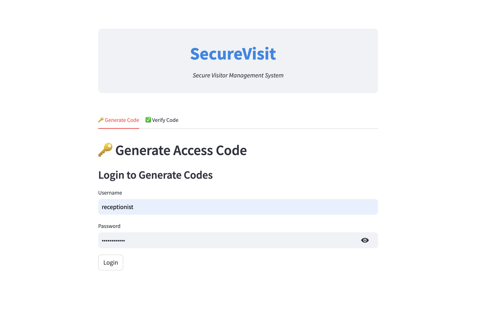
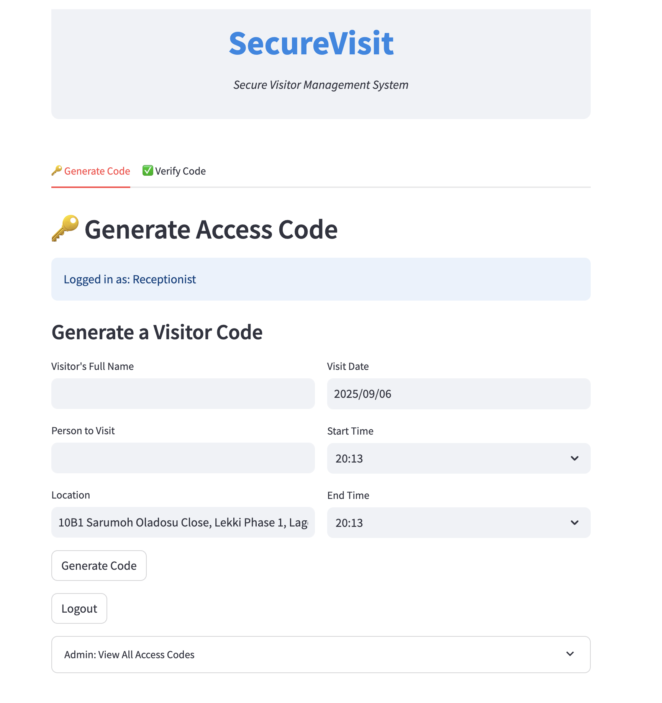
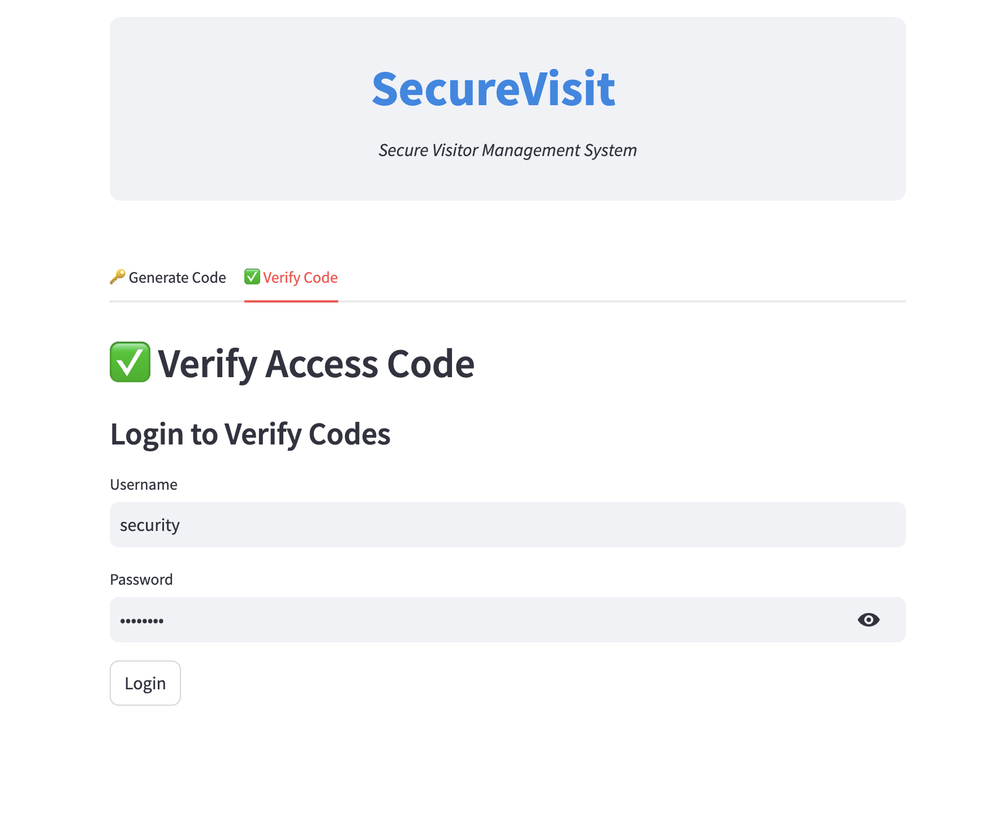
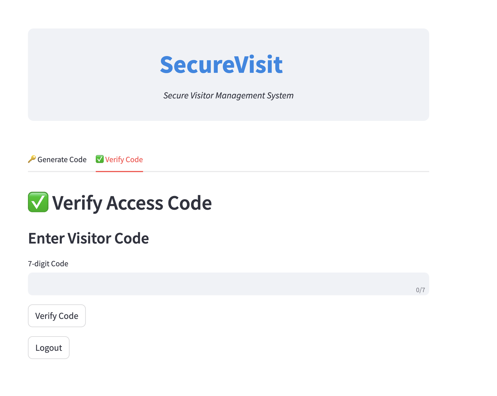
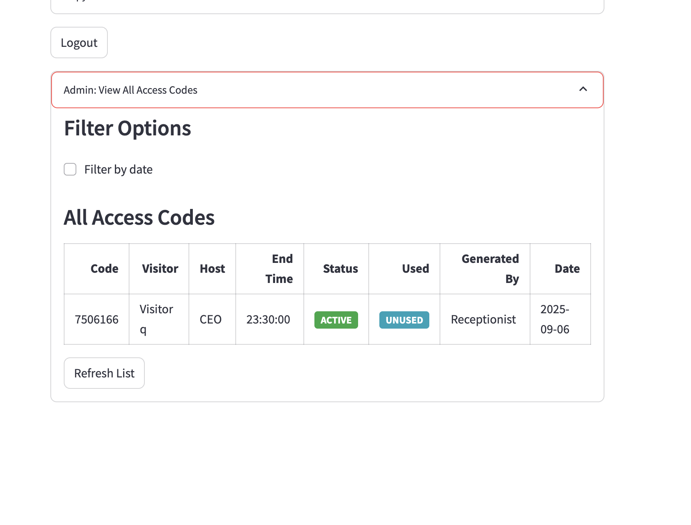

# SecureVisit – Visitor Management System

A **secure visitor access management system** built with **Flask + Streamlit** and deployed on **Render**.  
This system was developed for **Rotawn Energy & Logistics** to streamline visitor entry, reduce delays, and improve overall security monitoring.  

---

## 🚀 Features
- **Receptionist Login** – Generate visitor access codes quickly.  
- **Access Code Generation** – Create unique 7-digit codes tied to visitor details, host, and visit duration.  
- **Security Guard Login** – Verify access codes instantly at entry points.  
- **Code Verification** – Check if a code is valid, active, expired, or already used.  
- **Admin Dashboard** – View all codes (active, used, and expired) with filtering options.  
- **Automatic Cleanup** – Expired codes are removed after 30 days.  
- **Cost Saving** – Helped reduce operational delays and improved efficiency.  

---

## 📸 Screenshots

### 1. Receptionist Login


### 2. Receptionist Creates Access Code


### 3. Access Code Example


### 4. Security Guard Login


### 5. Security Guard Verifies Access Code


### 6. Admin Dashboard – Manage Codes


---

## 🛠️ Tech Stack
- **Backend:** Flask, Streamlit  
- **Database:** PostgreSQL  
- **Deployment:** Render  
- **Other:** Python (pandas, psycopg2, dotenv), HTML/CSS (for UI styling)  

---

## ⚙️ Installation & Setup

### 1. Clone the Repository
```bash
git clone https://github.com/dubemmmm/visitor-management-system.git
cd securevisit

